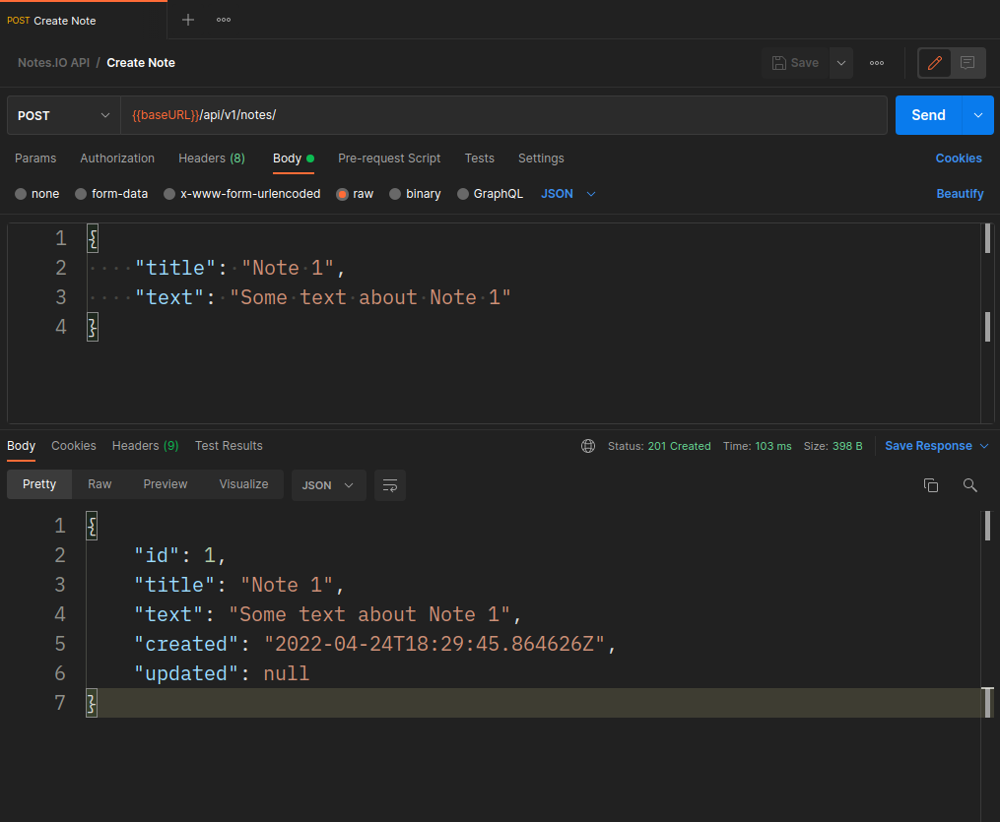
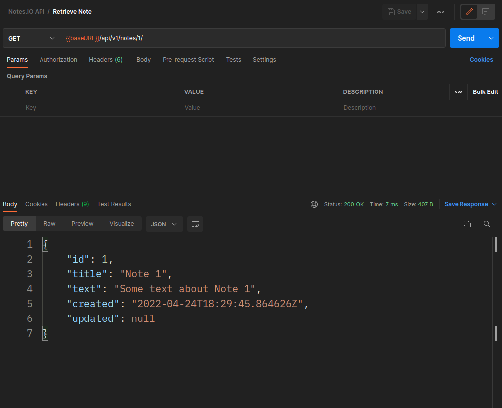
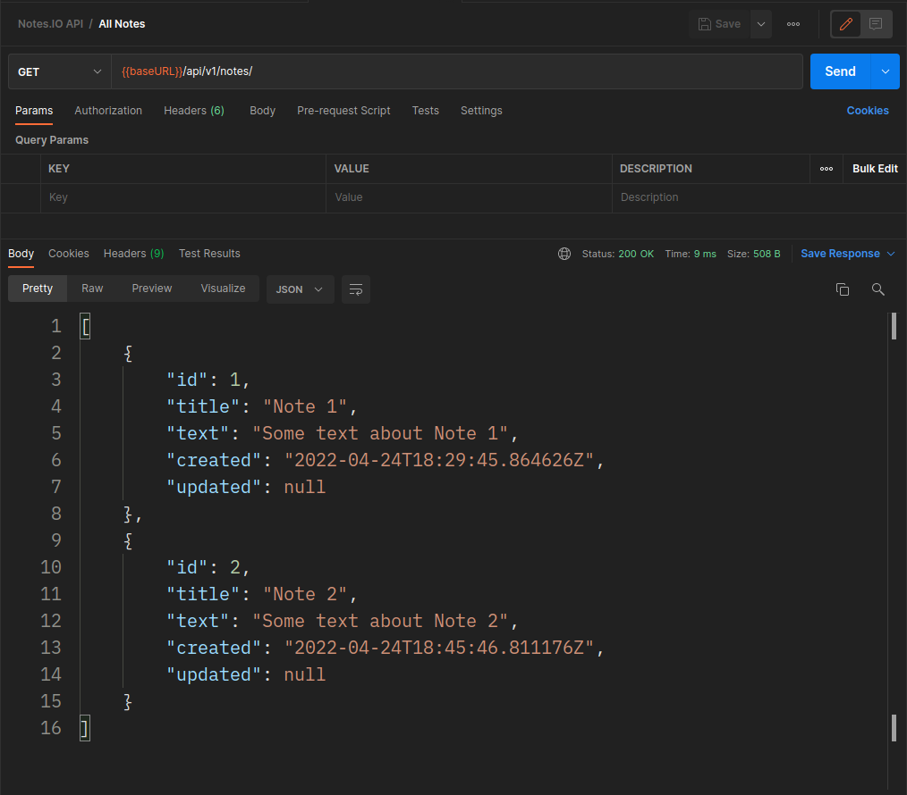
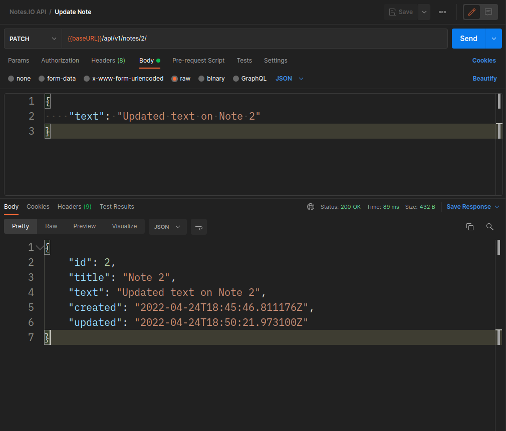

# notes.io API
Restful API for notes.io

Checkout a simple note application using note.io API as backend: <a href="https://github.com/blaqice-dev/notes.io">notes.io desktop application</a>
# Requirements
* Python 3 
* Django (3.0, 3.1, 3.2, 4.0)
* Django Rest framework 3
* Install from requirements.txt

# Endpoints
* Create note - **localhost:8000/api/v1/notes/**
* Retrieve all notes - **localhost:8000/api/v1/notes/**
* Retrieve note - **localhost:8000/api/v1/notes/<<int:id>>/**
* Update note - **localhost:8000/api/v1/notes/<<int:id>>/**
* Delete note - **localhost:8000/api/v1/notes/<<int:id>>/**


# Examples
### Create Note
**Using Python 3**
```python
import requests
import json

url = "localhost:8000/api/v1/notes/"

payload = json.dumps({
    "title": "Note 1",
    "text": "Some text about Note 1"
})
headers = {
    'Content-Type': 'application/json'
}

response = requests.request("POST", url, headers=headers, data=payload)

print(response.text)

```

**Using Postman**


### Retrieve Note
**Using Python 3**
```python

import requests

url = "localhost:8000/api/v1/notes/1/"

payload={}
headers = {}

response = requests.request("GET", url, headers=headers, data=payload)

print(response.text)

```
**Using Postman**


### Retrieve All Notes
**Using Python 3**
```python

import requests

url = "localhost:8000/api/v1/notes/"

payload={}
headers = {}

response = requests.request("GET", url, headers=headers, data=payload)

print(response.text)

```
**Using Postman**


### Update Note
**Using Python 3**
```python

import requests
import json

url = "localhost:8000/api/v1/notes/2/"

payload = json.dumps({
    "text": "Updated text on Note 2"
})
headers = {
    'Content-Type': 'application/json'
}

response = requests.request("PATCH", url, headers=headers, data=payload)

print(response.text)

```
**Using Postman**


### Delete Note
**Using Python**
```python

import requests

url = "localhost:8000/api/v1/notes/1/"

payload={}
headers = {}

response = requests.request("DELETE", url, headers=headers, data=payload)

print(response.text)

```