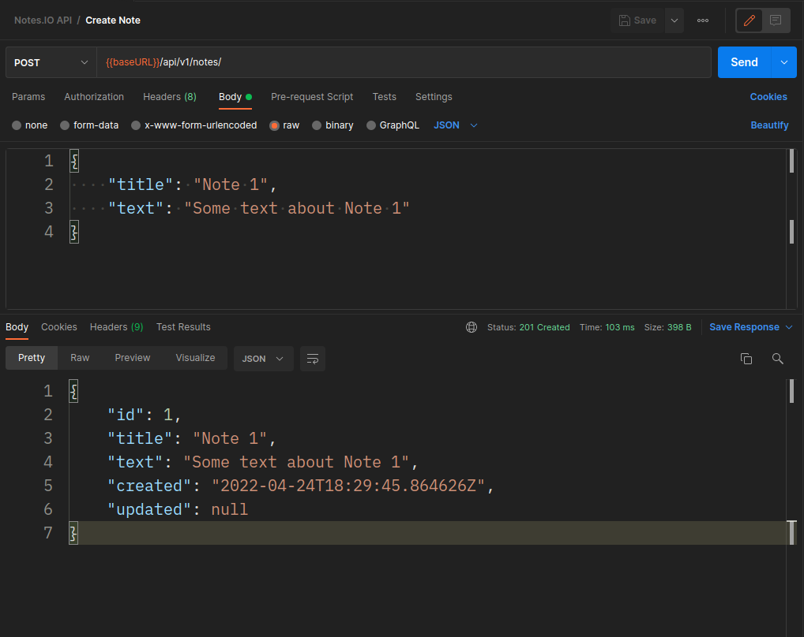

# notes.io-api
Restful API for notes.io

### Create Note
**Using Python 3**
```python
import requests
import json

url = "localhost:8000/api/v1/notes/"

payload = json.dumps({
    "title": "Note 1",
    "text": "Some text about Note 1"
})
headers = {
    'Content-Type': 'application/json'
}

response = requests.request("POST", url, headers=headers, data=payload)

print(response.text)

```

**Using Postman**


### Retrieve Note
**Using Python 3**
```python

import requests

url = "localhost:8000/api/v1/notes/1/"

payload={}
headers = {}

response = requests.request("GET", url, headers=headers, data=payload)

print(response.text)

```
**Using Postman**


### Retrieve All Notes
**Using Python 3**
```python

import requests

url = "localhost:8000/api/v1/notes/"

payload={}
headers = {}

response = requests.request("GET", url, headers=headers, data=payload)

print(response.text)

```
**Using Postman**

